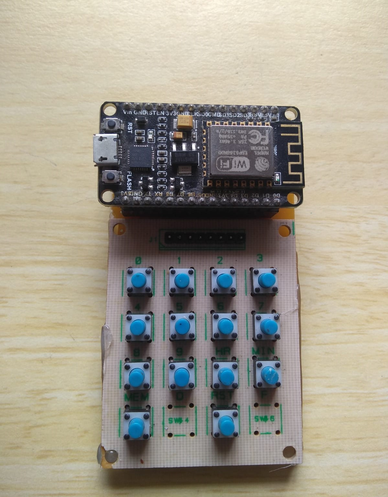

# ESP8266-KeyPad

A 4x4 keypad using a ESP8266 

A simple 4X4 matrix keyboard is connected to a ESP8266 NodeMCU development board.

Had both the components lieing around and collecting dust so decided to throw them together in this project. Thats basically the inspiration for this proj :P

Unluckyly NodeMCU doesn't support the Arduino Keyboard library. This is kinda a problem in disguise. To get over this problem I wrote a custom python script that connects with this board. 

In that script we can have custom key configurations and combination of commands. It is way easier to edit that config file rather than reprograming the NodeMCU each time. The github link for that python script is given below

https://github.com/HimaSava/Keypad_Configurator

My Board:

Overall a very basic proj that you can do within a day/ weekend. 

But fare warning, I have been using this for the past week and I am completely addicted to it!!

-HimaSava